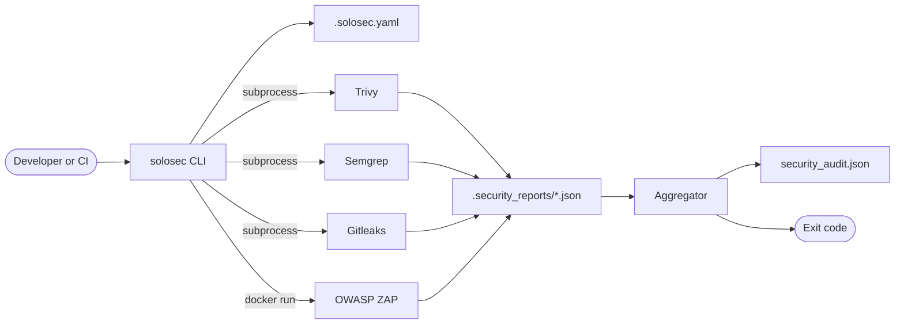

# Architecture overview

SoloSec is an orchestrator. It runs no analysis of its own — its job is to
invoke four third-party scanners consistently, reconcile their incompatible
output formats into one model, and reduce the result to a single exit code.

## System context

The three static scanners run as subprocesses against the filesystem. ZAP is
different: it is a container launched through the Docker daemon, and it needs a
running application rather than source files.

## Components

All under `src/solosec/`.

| Module | Responsibility |
| --- | --- |
| `cli.py` | Entry point. Parses arguments, sequences the stages, prints progress, returns the exit code. |
| `config.py` | Parses `.solosec.yaml` and resolves it against CLI arguments into a `ResolvedConfig`. Also the `solosec-config` entry point. |
| `tooling.py` | Builds and runs each scanner's command line. The only module that touches subprocesses. |
| `aggregate.py` | Parses each tool's JSON, normalises findings, writes the report, prints the summary. Also the `solosec-aggregate` entry point. |
| `_models.py` | Shared dataclasses and typed dicts. No logic. |

The dependency direction is one-way: `cli` depends on the other three, and
`config`, `tooling`, and `aggregate` do not depend on each other. `_models` is a
leaf.

## Data flow through a scan

1. **Resolve configuration.** `config.resolve_config` reads `.solosec.yaml` if
   present and merges it with CLI arguments. A missing or unparsable file yields
   defaults.
2. **Prepare the report directory.** `.security_reports/` is created in the
   project root, and appended to `.gitignore` if that file exists and does not
   already list it.
3. **Run each enabled tool.** Each writes its native JSON into the report
   directory. A tool that is missing or fails produces a warning; the sequence
   continues regardless.
4. **Aggregate.** Each report file that exists is parsed into a common `Finding`
   record and severities are normalised onto one scale.
5. **Report and exit.** Findings are sorted by severity, written to
   `security_audit.json`, summarised as a table, and reduced to an exit code.

The stages communicate through files on disk, not in memory. That is why
`solosec-aggregate` can run standalone against a directory of reports that some
other process produced.

## Design notes

### Failure is non-fatal by default

A scanner that is missing or crashes does not abort the run or fail the build.
The rationale is that a partial scan is more useful than none — but the
consequence is that a green build does not prove every scanner ran. `tools_run`
in the report records which reports were actually found.

### Only Critical and High fail the build

`DEFAULT_FAIL_ON_SEVERITIES` is `("CRITICAL", "HIGH")`. The threshold is a
parameter of `generate_report`, but nothing in the CLI or config file exposes
it, so in practice it is fixed. Lower severities are still collected and
reported.

Two normalisation choices interact with this and are worth stating plainly:
Gitleaks findings are assigned `CRITICAL` unconditionally, so any detected
secret fails a build; and Semgrep's `ERROR` maps to `HIGH`, so Semgrep's own
notion of a serious finding also fails a build. See
[Report format](../reference/report-format.md#severity-normalisation).

### The config parser is deliberately minimal

`.solosec.yaml` is read by about 110 lines of hand-written parsing rather than
a YAML library, which keeps the runtime dependency list to `rich` and `semgrep`.
The trade-off is real: only the exact shapes SoloSec needs are supported, and
unsupported syntax is ignored rather than rejected, so a malformed config
degrades to defaults silently. `solosec-config` exists largely to make that
failure mode visible.

### ZAP runs as a sibling container

The other three tools are executables on `PATH`. ZAP is invoked as
`docker run ... ghcr.io/zaproxy/zaproxy:stable`, which has two consequences.

First, Docker is a hard prerequisite of both installers even though only the
DAST stage uses it.

Second, when SoloSec is *itself* containerised, the report path it wants to
mount is a path inside its own container, which the host's Docker daemon cannot
resolve. The `SOLOSEC_HOST_REPORT_DIR`, `SOLOSEC_HOST_WORKSPACE`, and
`GITHUB_WORKSPACE` environment variables exist to supply the host path instead.
This is the reason the GitHub Action passes `GITHUB_WORKSPACE` through.

### The container runs unprivileged

The image runs as UID 10001 rather than root. Because callers are expected to
override the UID with `--user` to match the owner of the mounted project, the
image cannot rely on a fixed home directory — scanner caches and settings live
under a world-writable `/var/tmp/solosec`, and `safe.directory` is set
system-wide so Gitleaks can read a repository owned by another user.

### Wrappers exist for source checkouts

`bin/` holds shell, PowerShell, and batch wrappers that locate the project root
and delegate to the installed CLI, preferring `uv run` and falling back to
`python -m solosec`. They exist so the tool is runnable from a plain checkout
without installation. They add no behaviour of their own.

## Trade-offs not taken

Three limitations are consequences of the design rather than oversights:

- **No incremental or diff-aware scanning.** Every run scans the whole tree.
- **No severity policy per tool.** You can disable a tool entirely, but you
  cannot say "fail on Trivy High but not Semgrep High".
- **No suppression mechanism.** There is no allowlist or baseline file, so a
  finding you have accepted will fail every subsequent build. Excluding the
  containing directory is the only lever, and it is a blunt one.
